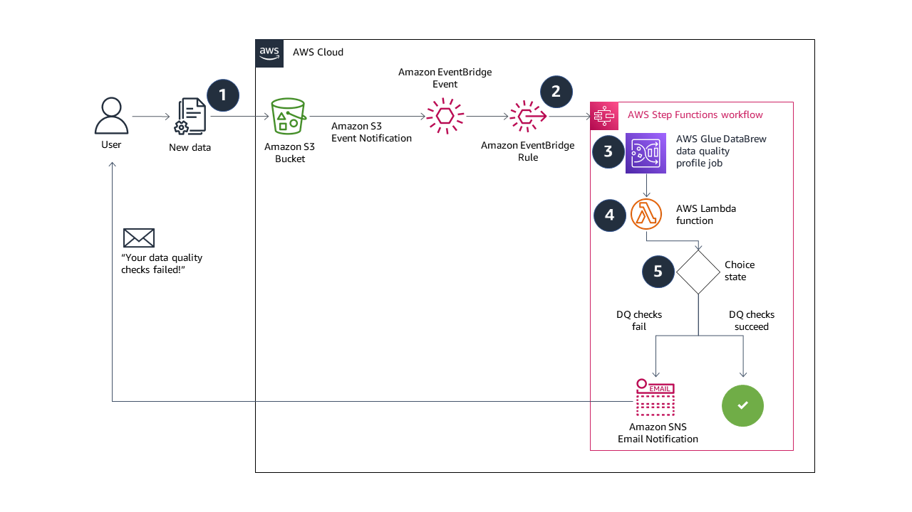

## Build event-driven data quality pipelines with AWS Glue DataBrew

This repository is a companion to the AWS Big Data Blog, located markdown url [here](https://aws.amazon.com/blogs/big-data/).

## Description

This repository contains a CloudFormation template and AWS Lambda Python 3.8 code to deploy the following architecture.

## Security

See [CONTRIBUTING](CONTRIBUTING.md#security-issue-notifications) for more information.

## License

This library is licensed under the MIT-0 License. See the LICENSE file.